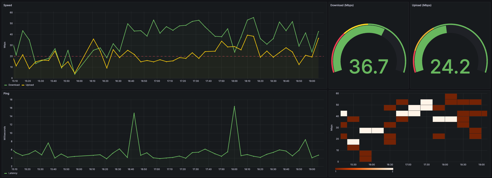

<div align="center">
<h1 align="center">

<br>SPEED-MONITOR</h1>
<h3>Keep tabs on your home internet speed and make your ISP step up their game – it's data-driven peace of mind!</h3>

<p align="center">


</p>


</div>

---



---

## 📖 Table of Contents
- [📖 Table of Contents](#-table-of-contents)
- [📍 Overview](#-overview)
- [📂 repository Structure](#-repository-structure)
- [⚙️ Modules](#modules)
- [🚀 Getting Started](#-getting-started)
    - [🔧 Installation](#-installation)
    - [🤖 Running speed-monitor](#-running-speed-monitor)
- [🤝 Contributing](#-contributing)
- [📄 License](#-license)
- [👏 Acknowledgments](#-acknowledgments)

---


## 📍 Overview

The Speed Monitor repository consists of a network speed monitoring Node.js application that periodically runs tests, storing the results such as download speed, upload speed, and latency in a PostgreSQL database. It uses a Grafana dashboard to visually represent this data. The configuration allows for setting of test intervals and database connections through environment variables. It is dockerized for deployment ease, and the use of dotenv, pg, and speedtest-net ensures precise and efficient project execution.

---


## 📂 Repository Structure

```sh
└── speed-monitor/
    ├── Dockerfile
    ├── db/
    │   └── init.sql
    ├── docker-compose.yml
    ├── grafana/
    │   └── dashboard.json
    ├── index.js
    ├── package-lock.json
    ├── package.json

```

---


## ⚙️ Modules

<details closed><summary>Root</summary>

| File                                                                                        | Summary                                                                                                                                                                                                                                                                                                                                                                                                                                                                                                            |
| ---                                                                                         | ---                                                                                                                                                                                                                                                                                                                                                                                                                                                                                                                |
| [index.js](https://github.com/mii9000/speed-monitor/blob/main/index.js)                     | This Node.js application periodically runs a network speed test, logging the results (download speed, upload speed, and latency) to a PostgreSQL database. The test run interval and database connection details are configured using environment variables. Docker and Docker Compose files are included for deployment, and Grafana is used to visualize the speed test data.                                                                                                                                    |
| [Dockerfile](https://github.com/mii9000/speed-monitor/blob/main/Dockerfile)                 | The code is a Dockerfile responsible for creating a Docker image. It uses the Node LTS image as base, sets /usr/src/app as the working directory, and copies package json files to install production dependencies. It then copies the remaining app files, exposes port 3000, and sets npm start as the default command to run on container startup. Other files suggest the application also involves a database, a Grafana dashboard, and uses Docker Compose for orchestration.                                |
| [package-lock.json](https://github.com/mii9000/speed-monitor/blob/main/package-lock.json)   | The code represents a package-lock.json file in a speed-monitor project. It provides a detailed record of the exact versions of dependencies installed for the project. These include dotenv, pg, and speedtest-net. This ensures that all installations of the project use the exact same versions of dependencies. The project structure includes Docker configuration, a database with an SQL init script, a Grafana dashboard, and Node.js application files.                                                  |
| [docker-compose.yml](https://github.com/mii9000/speed-monitor/blob/main/docker-compose.yml) | The code is a Docker Compose configuration for a network speed monitoring application comprised of three services. The app service runs the application, connecting to a Postgres db service for data storage. A grafana service displays application data through dashboards. The application uses environment variables for database connection details and speed test interval setting. The application and database are exposed over ports 3000 and 5432, respectively, and Grafana is exposed over port 3001. |
| [package.json](https://github.com/mii9000/speed-monitor/blob/main/package.json)             | The speed-monitor is a Node.js application that utilizes dotenv to manage environment variables, pg to interact with a Postgres database, and speedtest-net to monitor internet speed. The application is Dockerized for easy deployment and works with Grafana for data visualization. The start-up script is defined in the package.json file. The SQL initialization script and Grafana dashboard configuration are included.                                                                                   |

</details>

<details closed><summary>Db</summary>

| File                                                                       | Summary                                                                                                                                                                                                                                                                                               |
| ---                                                                        | ---                                                                                                                                                                                                                                                                                                   |
| [init.sql](https://github.com/mii9000/speed-monitor/blob/main/db/init.sql) | The provided code is part of a speed monitoring application. It employs Docker and Grafana for visualizations. The db/init.sql file initiates a PostgreSQL table, speedtest_results, to store internet speed test data which includes download speed, upload speed, latency, and the time of testing. |

</details>

<details closed><summary>Grafana</summary>

| File                                                                                        | Summary                                                                                                                                                                                                                                                                                                                                                                                                                                                                                                      |
| ---                                                                                         | ---                                                                                                                                                                                                                                                                                                                                                                                                                                                                                                          |
| [dashboard.json](https://github.com/mii9000/speed-monitor/blob/main/grafana/dashboard.json) | The code defines a Grafana dashboard configuration for visualizing internet speed. It fetches data from a Postgres datasource and presents it as time-series graphs for download and upload speeds, latency (Ping), and gauges for average download and upload speeds. It also includes a heatmap representing the average download speed over time. Customization options like colors, thresholds, tooltips, legends, and data source queries are specified. This dashboard auto-refreshes every 5 minutes. |

</details>

---

## 🚀 Getting Started

***Dependencies***

Please ensure you have the following dependencies installed on your system:

`- ℹ️ Docker`

`- ℹ️ Docker Compose`

### 🔧 Installation

1. Clone the speed-monitor repository:
```sh
git clone https://github.com/mii9000/speed-monitor
```

2. Change to the project directory:
```sh
cd speed-monitor
```

### 🤖 Running speed-monitor

```sh
► docker-compose up -d
```

---

## 🤝 Contributing

Contributions are welcome! Here are several ways you can contribute:

- **[Submit Pull Requests](https://github.com/mii9000/speed-monitor/blob/main/CONTRIBUTING.md)**: Review open PRs, and submit your own PRs.
- **[Join the Discussions](https://github.com/mii9000/speed-monitor/discussions)**: Share your insights, provide feedback, or ask questions.
- **[Report Issues](https://github.com/mii9000/speed-monitor/issues)**: Submit bugs found or log feature requests for MII9000.

#### *Contributing Guidelines*

<details closed>
<summary>Click to expand</summary>

1. **Fork the Repository**: Start by forking the project repository to your GitHub account.
2. **Clone Locally**: Clone the forked repository to your local machine using a Git client.
   ```sh
   git clone <your-forked-repo-url>
   ```
3. **Create a New Branch**: Always work on a new branch, giving it a descriptive name.
   ```sh
   git checkout -b new-feature-x
   ```
4. **Make Your Changes**: Develop and test your changes locally.
5. **Commit Your Changes**: Commit with a clear and concise message describing your updates.
   ```sh
   git commit -m 'Implemented new feature x.'
   ```
6. **Push to GitHub**: Push the changes to your forked repository.
   ```sh
   git push origin new-feature-x
   ```
7. **Submit a Pull Request**: Create a PR against the original project repository. Clearly describe the changes and their motivations.

Once your PR is reviewed and approved, it will be merged into the main branch.

</details>

---

## 📄 License


This project is protected under the [MIT](https://choosealicense.com/licenses/mit) License.

---

## 👏 Acknowledgments

- Motivation: My home internet service provider
- Inspiration: https://github.com/gonzalo123/speed

[**Return**](#Top)

---
