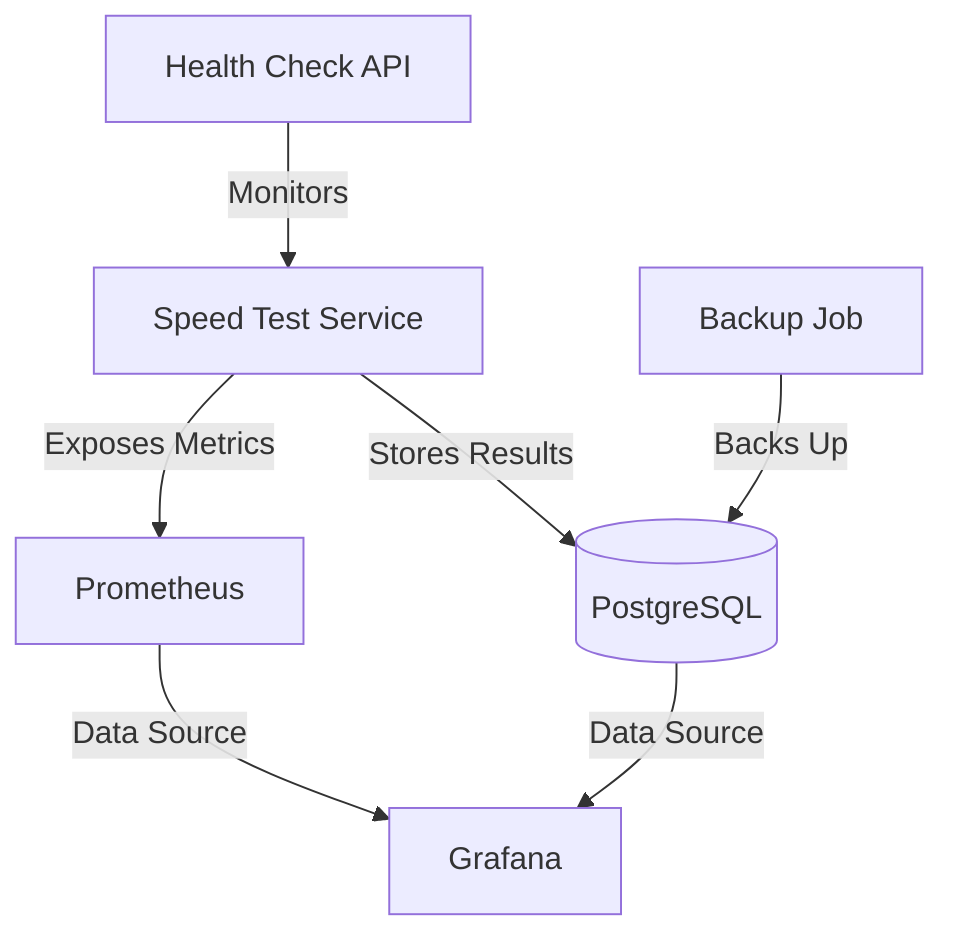

# 🚀 NubemSM - Network Speed Monitor

<div align="center">


**Enterprise-grade network speed monitoring solution with real-time analytics, alerting, and historical trending.**

[Features](#features) • [Quick Start](#quick-start) • [Architecture](#architecture) • [API](#api) • [Contributing](#contributing)


</div>

## 🎯 Features

- **🔄 Automated Speed Tests**: Configurable intervals with retry logic
- **📊 Real-time Dashboard**: Grafana-powered visualization
- **🔔 Smart Alerting**: Threshold-based notifications
- **🔒 Enterprise Security**: Non-root containers, secret management
- **📈 Prometheus Metrics**: Complete observability stack
- **🐳 Production Ready**: Health checks, auto-restart, resource limits
- **💾 Automated Backups**: Daily PostgreSQL backups with retention
- **🌍 Multi-region Support**: Deploy anywhere with Docker

## 🚀 Quick Start

### Prerequisites

- Docker 20.10+
- Docker Compose 2.0+
- 2GB RAM minimum
- 10GB disk space

### Installation

1. **Clone the repository**
   ```bash
   git clone https://github.com/NUbem000/NubemSM.git
   cd NubemSM
   ```

2. **Configure environment**
   ```bash
   cp .env.example .env
   # Edit .env with your settings
   ```

3. **Start services**
   ```bash
   docker-compose -f docker-compose.prod.yml up -d
   ```

4. **Access dashboards**
   - Grafana: http://localhost:3001 (admin/your_password)
   - Prometheus: http://localhost:9090
   - Health API: http://localhost:3000/health

## 🏗️ Architecture



### Components

- **Speed Monitor**: Node.js application running periodic speed tests
- **PostgreSQL**: Time-series data storage with indexing
- **Grafana**: Visualization and alerting
- **Prometheus**: Metrics collection and monitoring
- **Backup Service**: Automated daily backups

## 📡 API Reference

### Health Check
```http
GET /health
```

Response:
```json
{
  "status": "healthy",
  "uptime": 3600,
  "timestamp": "2024-01-01T12:00:00Z"
}
```

### Metrics
```http
GET /metrics
```

Prometheus-formatted metrics including:
- `speedtest_runs_total`
- `speedtest_errors_total`
- `nodejs_heap_size_used_bytes`

## 🔧 Configuration

### Environment Variables

| Variable | Description | Default |
|----------|-------------|---------|
| `SPEEDTEST_INTERVAL` | Test interval in ms | 300000 (5 min) |
| `DB_HOST` | PostgreSQL host | db |
| `DB_USER` | Database user | speedmonitor |
| `DB_PASSWORD` | Database password | Required |
| `LOG_LEVEL` | Logging level | info |

### Advanced Configuration

See [docs/configuration.md](docs/configuration.md) for:
- Custom Grafana dashboards
- Alert configurations
- Backup schedules
- Resource tuning

## 📊 Monitoring & Alerts

### Default Alerts

1. **Connection Loss**: No tests completed in 15 minutes
2. **Speed Degradation**: 50% drop from baseline
3. **High Latency**: Ping > 100ms sustained
4. **Service Health**: Container restarts

### Custom Alerts

Create custom alerts in Grafana based on your SLA requirements.

## 🔒 Security

- ✅ Non-root container execution
- ✅ Secret management via environment files
- ✅ Network isolation between services
- ✅ Regular dependency updates
- ✅ OWASP dependency scanning
- ✅ Trivy container scanning

See [SECURITY.md](SECURITY.md) for detailed security practices.

## 🧪 Development

### Local Development

```bash
# Install dependencies
npm install

# Run tests
npm test

# Start with hot reload
npm run dev
```

### Testing

```bash
# Unit tests
npm test

# Integration tests
docker-compose -f docker-compose.test.yml up --abort-on-container-exit

# Linting
npm run lint
```

## 📈 Performance

- Memory usage: ~256MB (app) + 512MB (PostgreSQL)
- CPU usage: <10% average on 1 vCPU
- Storage: ~1GB/year of data
- Network: Minimal bandwidth usage

## 🤝 Contributing

We welcome contributions! Please see [CONTRIBUTING.md](CONTRIBUTING.md) for:
- Code of conduct
- Development setup
- Pull request process
- Coding standards

## 📄 License

This project is licensed under the MIT License - see [LICENSE](LICENSE) file.

## 🙏 Acknowledgments

- Original inspiration: [gonzalo123/speed](https://github.com/gonzalo123/speed)
- Built with ❤️ by the NubemSM team

## 📞 Support

- 📧 Email: support@nubem.dev
- 💬 Discord: [Join our server](https://discord.gg/nubem)
- 🐛 Issues: [GitHub Issues](https://github.com/NUbem000/NubemSM/issues)

---

<div align="center">
Made with ❤️ by NubemSM Team
</div>